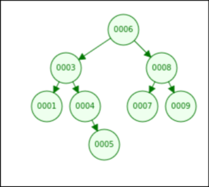
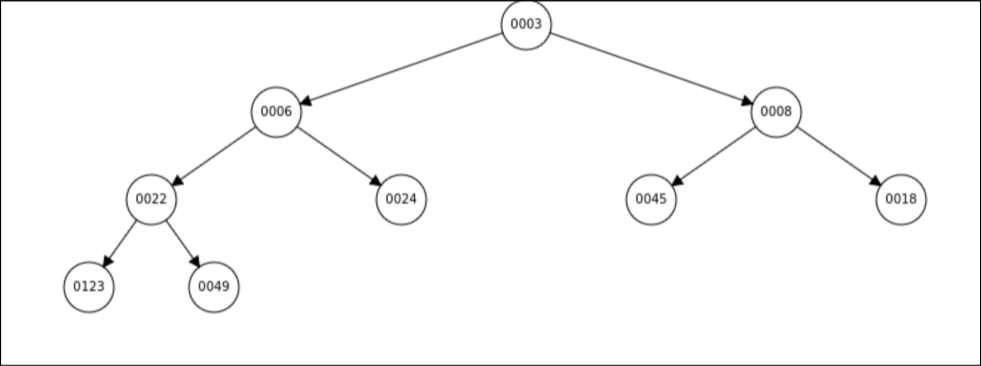

# 二元樹
其實競賽中不太會需要自己寫但還是要會

## BST (Binary Search Tree)
左子樹的數值比自己小，右子樹的數值比自己大

通常都可以支援 `insert`, `delete`, `find` 等等操作


```cpp
struct Node {
    Node* lson, rson;
    int val;
};
```

preorder: 
```cpp
void preorder(Node* now) {
    if (!now) return;
    cout << now -> val << endl;
    preorder(now -> lson);
    preorder(now -> rson);
}
```
6 -> 3 -> 1 -> 4 -> 5 -> 8 -> 7 -> 9 <br>

inorder: 
```cpp
void inorder(Node* now) {
    if (!now) return;
    inorder(now -> lson);
    cout << now -> val << endl;
    inorder(now -> rson);
}
```
1 -> 3 -> 4 -> 5 -> 6 -> 7 -> 8 -> 9 <br>

postorder: 1 -> 5 -> 4 -> 3 -> 7 -> 9 -> 8 -> 6
```cpp
void postorder(Node* now) {
    if (!now) return;
    postorder(now -> lson);
    postorder(now -> rson);
    cout << now -> val << endl;
}
```

[例題](https://tioj.sprout.tw/problems/47)

## BBST (Balanced Binary Search Tree)
除了是 BST 之外，還額外要求這個二元樹的最深深度只有 $O(\log N)$ 量級

基本上 C++ 都幫你寫好了，只要當黑盒子用就好

Eg: Splay, RB Tree, AVL Tree 等等

C++ 的 `std::set<T>, std::map<T,U>` 預設是用 RB Tree 實作，但是要的話可以改成 splay (但沒必要改)

比較需要知道怎麼寫的就是 treap 或 splay 選一種就好（多數人目前是用 treap)

## Heap
父節點的數值比子節點大/小



在 C++ 中的實作對應到 `std::priority_queue<T>` (很好用而且比 `std::set` 快很多)

