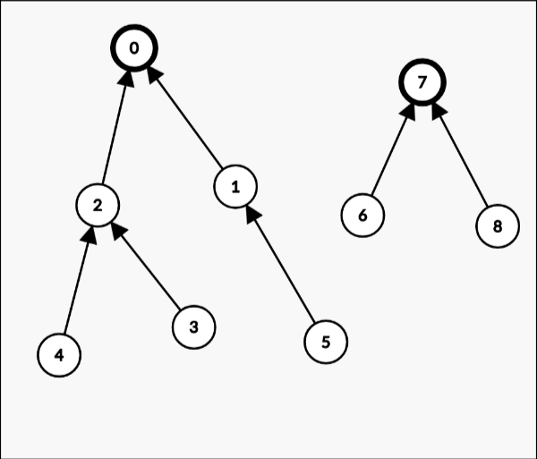

# Disjoint Set (並查集)
## 定義
一個資料結構，支援：
- find(x): 找出一個代表 $x$ 的集合的人，並且如果 $x, y$ 在同一個集合，則 $find(x) = find(y)$
- union(x, y): 將 $x, y$ 所在的兩個集合合併

## 暴力
```cpp
struct DSU {
    int n;
    vector<int> root;
    DSU(int _n): root(_n), n(_n) {
        iota(root.begin(), root.end(), 0);
    }
    int find(x) {
        return root[x];
    }
    void union(int x, int y) {
        for(int i = 0;i<n;i++) {
            if (root[i] == y) root[i] = x;
        }
        return;
    }
};
```
複雜度？
- find(x)?
- union(x, y)?

## Linked List
```cpp
struct DSU {
    int n;
    vector<linked_list<int>> nodes;
    vector<int> node_id;
    DSU(int _n): n(_n), node(_n), node_id(_n) {
        iota(node_id.begin(), node_id.end(), 0);
        for(int i = 0;i<n;i++) node[i].push_back(i);
    }
    int find(int x) {
        return node_id[x];
    }
    void union(int x, int y) {
        x = find(x);
        y = find(y);
        while (!nodes[y].empty()) {
            int z = *nodes[y].begin();
            nodes[y].erase(nodes[y].begin());
            nodes[x].push_back(z);
            node_id[z] = x;
        }
        return;
    }
}
```
複雜度？
- find(x)?
- union(x, y)?

### 稍微好一點的 linked list
```cpp
struct DSU {
    ... 都上面一樣，只有 union 不同
    void union(int x, int y) {
        x = find(x);
        y = find(y);
        if (nodes[x].size() < nodes[y].size()) swap(x, y); // <-- 多加這行
        while (!nodes[y].empty()) {
            int z = *nodes[y].begin();
            nodes[y].erase(nodes[y].begin());
            nodes[x].push_back(z);
            node_id[z] = x;
        }
        return;
    }
}
```
複雜度？
- find(x)?
- union(x, y)?

## Disjoint Forest
可以想成每個連通塊都是一個森林，並且每個節點都紀錄自己的父節點是誰


所以，要檢查是不是同一個連通塊就兩個人都分別走到根節點，然後看根節點一不一樣就好

```cpp
struct DSU {
    vector<int> par;
    int n;
    DSU(int _n): n(_n), par(n) {
        iota(par.begin(), par.end(), 0);
    }
    int find(int x) {
        while(x != par[x]) x = par[x];
        return x;
    }
    void union(int x, int y) {
        x = find(x), y = find(y);
        par[y] = x;
    }
};
```
複雜度？
- find(x)?
- union(x, y)?

### Disjoint Forest with Small-to-Large
會發現上面的狀況沒有保證複雜度會好(可以構造讓你每次跑 $O(n)$)，所以考慮合併時加速
```cpp
struct DSU {
    vector<int> par;
    vector<int> sz; //紀錄連通塊裡的人數
    int n;
    DSU(int _n): n(_n), par(n) {
        iota(par.begin(), par.end(), 0);
        fill(sz.begin(), sz.end(), 1);
    }
    int find(int x) {
        while(x != par[x]) x = par[x];
        return x;
    }
    void union(int x, int y) {
        x = find(x), y = find(y);
        if (sz[x] < sz[y]) swap(x, y); // <-- 加這行
        par[y] = x;
    }
};
```
複雜度？
- find(x)?
- union(x, y)?

### Disjoint Forest With Path Compression
會發現查詢的時候感覺做快取就很棒
```cpp
struct DSU {
    // 除了 find 以外都一樣
    int find(int x) {
        int p = x;
        while(p != par[p]) p = par[p];
        while(x != p) {
            int tmp = par[x];
            par[x] = p;
            x = tmp;
        }
    }
}
```
如果同時使用啟發式合併＋路徑壓縮那複雜度會變成均攤的 $O(N \alpha(N))$ ，其中 $\alpha(N)$ 為反阿克曼函數，成長超級慢，大概在 $N <= 10 ^ {9}$ 以內 $\alpha(N) \le 5$

一個範例 implementation:
```cpp
const int mxn = 2e5 + 10;
struct DSU {
    int par[mxn], sz[mxn];
    DSU() {
        fill(sz, sz+mxn, 1);
        iota(par, par + mxn, 0);
    }
    int find(int x) {
        return x == par[x]?x:par[x] = find(par[x]);
    }
    void onion(int a, int b) { // 因為 union 在 C/C++ 有用到
        a = find(a), b = find(b);
        if (a == b) return;
        if (sz[a] < sz[b]) swap(a, b);
        par[b] = a;
        sz[a] += sz[b];
        return;
    }
};
```
